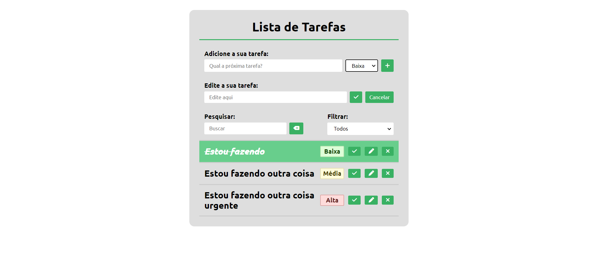

# Lista de Tarefas ([Click Here](https://to-do-list-umber-one.vercel.app/))

## SOBRE ESTE PROJETO!
Este é um projeto proposto pelo professor [José Roberto Campos](https://github.com/jrcampos82), no andamento da disciplina "Desenvolvimento Web Dinâmico", do curso superior Análise e Desenvolvimento de Sistemas, no Instituto Federal de Mato Grosso do Sul ["(IFMS)"](https://www.ifms.edu.br/campi/campus-tres-lagoas).

## Objetivo
O objetivo do projeto é criar um website de "Lista de Tarefas".

## Tecnologias usadas
* HTML5
* CSS3
* JavaScript
* Layout Responsivo

## Acessar minha resolução
Eu hospedei este projeto com a ajuda da [Vercel](https://vercel.com/), para acessar minha resolução deste desafio [Clique Aqui](https://to-do-list-umber-one.vercel.app/)